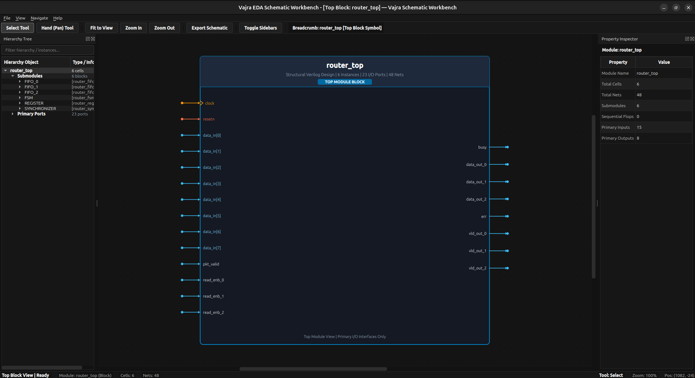
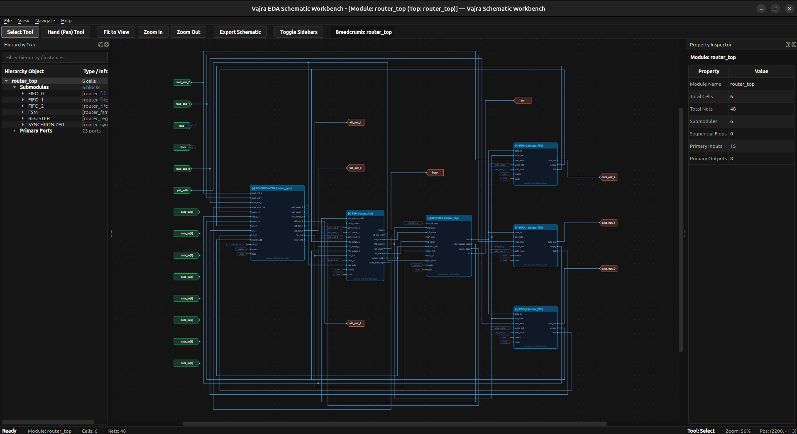
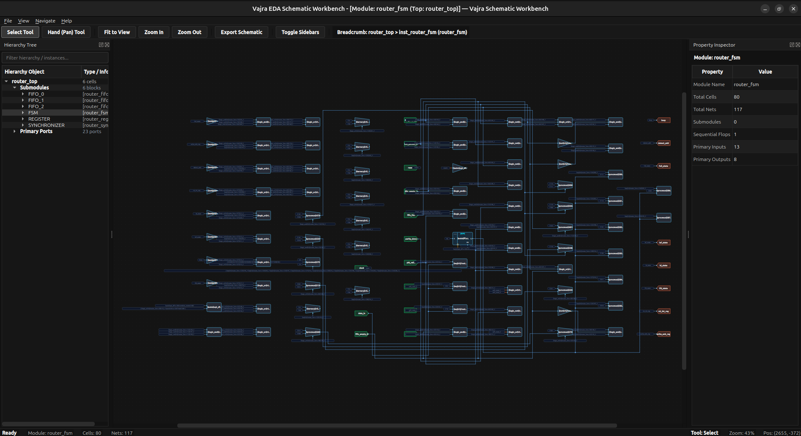

# vajra_gui

[](https://github.com/YosysHQ/yosys)
[](https://isocpp.org/)
[](https://www.qt.io/)
[](https://cmake.org/)
[](LICENSE)

An interactive schematic viewer and netlist analysis plugin for Yosys.

## Screenshots

### TOP-Level box view


### Hierarchical Top-Level Module (Router1x3)


### FSM Submodule Gate-Level Logic


## Features

- Native ANSI/IEEE vector gate rendering for unmapped GTECH and RTLIL primitives.
- Liberty (.lib) parser for resolving and rendering technology-mapped ASIC/FPGA standard cells.
- Automated multi-stage Sugiyama placement engine and orthogonal Manhattan router.
- Full hierarchy navigation: drill down into submodules and ascend back to top.
- Dockable Hierarchy Tree and Property Inspector with bidirectional net highlighting.
- High-resolution schematic export to SVG, PDF, and PNG formats.
- Embedded dark theme canvas with smooth pan, zoom, and selection controls.
- Portable build system supporting Qt5 and Qt6 across Linux distributions.

## Prerequisites

- C++20 compatible compiler (GCC >= 10, Clang >= 11)
- CMake (>= 3.20)
- Yosys (>= 0.60)
- Qt5 or Qt6 development packages:

```bash
# Ubuntu / Debian (Qt5)
sudo apt install qtbase5-dev libqt5svg5-dev

# Ubuntu 24.04+ / Debian (Qt6)
sudo apt install qt6-base-dev libqt6svg6-dev

# Fedora
sudo dnf install qt5-qtbase-devel qt5-qtsvg-devel
```

## Build and Installation

### Option A: Standard Build (System Install)

```bash
git clone https://github.com/keyurd1998-sys/Vajra_GUI.git
cd Vajra_GUI
cmake -B build .
cmake --build build --parallel
sudo cmake --install build
```

This compiles `vajra.so` and installs it into Yosys's default plugin directory.

### Option B: User-Space Build (No Root / No Sudo Required)

If you do not have root or sudo privileges:

```bash
git clone https://github.com/keyurd1998-sys/Vajra_GUI.git
cd Vajra_GUI
cmake -B build .
cmake --build build --parallel
```

Load the plugin directly via environment variable without installing to system folders:

```bash
export YOSYS_PLUGIN_PATH=$PWD/build
yosys -m vajra
```

Or pass the direct path:

```bash
yosys -m ./build/vajra.so
```

### Option C: With Pre-Compiled Yosys (OSS CAD Suite / Custom Path)

If using OSS CAD Suite or a custom Yosys build, point CMake to its `yosys-config`:

```bash
cmake -B build -DYOSYS_CONFIG=/path/to/oss-cad-suite/bin/yosys-config .
cmake --build build --parallel
```

## Usage

### 1. Interactive Shell

Start Yosys with the plugin loaded:

```bash
yosys -m vajra
```

Inside the Yosys command prompt:

```tcl
read_verilog counter.v
proc; opt
gui
```

### 2. Technology-Mapped Netlists

View designs mapped to standard cell libraries (e.g., SkyWater 130nm):

```tcl
read_verilog counter.v
proc; opt; techmap; opt
dfflibmap -liberty sky130_fd_sc_hd.lib
abc -liberty sky130_fd_sc_hd.lib
clean
gui -lib sky130_fd_sc_hd.lib
```

### 3. In Tcl Synthesis Scripts

Add `plugin -i vajra` inside any synthesis script:

```tcl
plugin -i vajra
gui -lib $LIB_TYPICAL
```

### 4. Headless Schematic Export

Export schematics without opening an interactive window (works on headless servers without a DISPLAY):

```bash
yosys -m vajra -p "read_verilog counter.v; proc; opt; gui -export counter.svg"
```

## Examples

A complete example using the `Router1x3` design is provided in `examples/`:

```bash
yosys -m ./build/vajra.so -p "read_verilog examples/router_top.v; hierarchy -check -top router_top; proc; opt; gui"
```

This synthesizes the multi-module router design and Launch Schematic viewer.

## Command Options

```text
gui [options] [selection]

  -top <module>
      Display specified top module or submodule (default: top module).

  -lib <file.lib>
      Load Liberty cell library to classify technology-mapped cells.

  -export <filename.png|svg|pdf>
      Export schematic to file and return immediately.

  -test
      Run headless placement and routing verification.
```

## Keyboard Shortcuts

| Key | Action |
| --- | --- |
| `S` | Select Tool (pointer mode) |
| `H` | Hand / Pan Tool Mode |
| `Spacebar` (hold) | Temporary pan mode |
| `F` | Fit schematic to view |
| `+` / `-` | Zoom in / Zoom out |
| `Ctrl + 0` | Reset zoom to 100% |
| `Double-click` | Drill down into submodule |
| `U` / `Backspace` | Ascend hierarchy |
| `Home` | Return to top module |
| `Ctrl + E` | Export schematic (SVG, PDF, PNG) |
| `Ctrl + T` | View top module block symbol |
| `B` | Toggle sidebars |
| `G` | Toggle grid dots |

## License

This project is licensed under the MIT License. See the [LICENSE](LICENSE) file for details.
